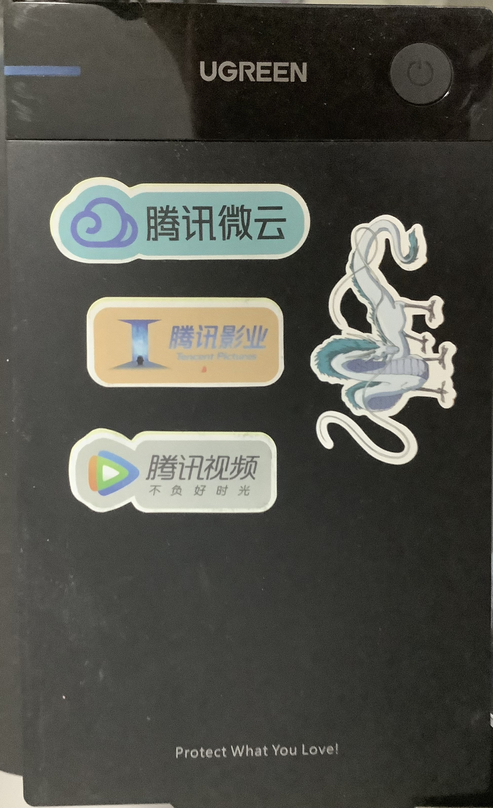

# Self Link
[gzg1984.github.io](https://gzg1984.github.io/)

## Welcome to GitHub Pages

You can use the [editor on GitHub](https://github.com/gzg1984/gzg1984.github.io/edit/main/index.md) to maintain and preview the content for your website in Markdown files.

Whenever you commit to this repository, GitHub Pages will run [Jekyll](https://jekyllrb.com/) to rebuild the pages in your site, from the content in your Markdown files.

### Markdown

Markdown is a lightweight and easy-to-use syntax for styling your writing. It includes conventions for

```markdown
Syntax highlighted code block
```
# Header 1
## 日本动画剧集
### 2T Vedio/日本动画

- [2022]测不准的阿波连同学
- 合集 命运石之门 [シュタインズ・ゲート]
- 小林家的龙女仆
- 无职转生 ～在异世界认真地活下去
- 末日时在做什么有没有空可以来拯救吗
- 进击的巨人
- [2022]异世界叔叔 Isekai Ojisan
- 东京食尸鬼
- [2020]格莱普尼尔
- [2022]莉可麗絲_Lycoris Recoil
- 灌篮高手重置版
- [2022]即使如此依旧步步逼近
- 月刊少女野崎君 [月刊少女野崎くん]
- [2022]更衣人偶陷入爱河
- [2021]奇蛋物语
- [生肉]无头骑士异闻录 [Durarara!! デュラララ!!]
- 人鱼之森
- [2019]约定的梦幻岛
- [2022]间谍过家家
- [多季度]来自深渊
- 合集 悠哉日常大王 [のんのんびより]
- 青春期笨蛋不做兔女郎学姐的梦 [青春ブタ野郎はバニーガール先輩の夢を見ない]
- 黄金神威
- [2021]女神宿舍的管理员
- [2022]赛博朋克：边缘跑手Cyberpunk.Edgerunners
- [多季度]OverLord
- [多季度]鬼灭之刃
- 为美好世界献上祝福
- [2022]彻夜之歌
- [2022]契约之吻_Engage Kiss
- [2022]孤独摇滚
- [2019]女高中生的虚度日常


### Mac_1T/日本动画

|名字||
|----|----|
|进击的巨人 最终季 S4||
|进击的巨人3||
|闪光的哈萨维||
|OnePunch||
|与变成了异世界美少女的大叔一起冒险||
|奇巧计程车||


1. Numbered
2. List

**Bold** and _Italic_ and `Code` text

[Link](url) and 


For more details see [GitHub Flavored Markdown](https://guides.github.com/features/mastering-markdown/).

### Jekyll Themes

Your Pages site will use the layout and styles from the Jekyll theme you have selected in your [repository settings](https://github.com/gzg1984/gzg1984.github.io/settings/pages). The name of this theme is saved in the Jekyll `_config.yml` configuration file.

### Support or Contact

Having trouble with Pages? Check out our [documentation](https://docs.github.com/categories/github-pages-basics/) or [contact support](https://support.github.com/contact) and we’ll help you sort it out.

## 进击的巨人 Should Reduce in:
- 进击的巨人
  - 2T Vedio.json
- 进击的巨人3
  - Mac_1T.json

## 巨人 Should Reduce in:
- 巨人
  - Gordon.json
- 进击的巨人3
  - Mac_1T.json

## 无职转生 Should Reduce in:
- 无职转生
  - Gordon.json
- 无职转生 ～在异世界认真地活下去
  - 2T Vedio.json